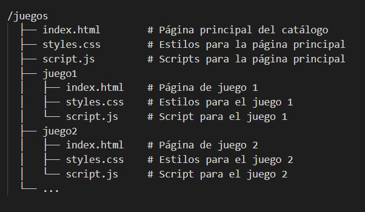

## 👋 hello

## Este proyecto consiste en la creación de una web de mini-juegos.

- Portada con catálogo.

- Mini-juego con opción de vuelta al menú.

## opción de crear un contenedor.

- Creación del contenedor

    ```bash
    docker build -t mini-juegos-web .

    ```

- Correr e contenedor

    ```bash
    docker run -d -p 8080:80 mini-juegos-web

    ```

## Estructura del proyecto:


